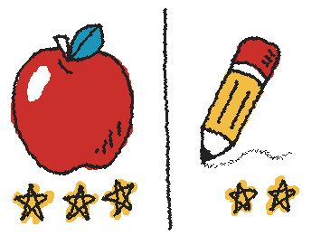

Sticky Dash is a fast-paced, team-based sticky ball game that adds some excitement, time pressure, and randomization to what would otherwise be a boring repeat-after-me type of task. It also has the added benefit of practicing motor skills and giving a chance to shine to those students who may perform better athletically than academically.

## Materials

* sticky ball

* whiteboard

* markers

* whiteboard eraser

* stopwatch or timer

## How to play

1. Create some targets areas on the board. They can be any shape, but it’s best to leave no areas empty. Also within each target area draw a small number of stars. I find 12 to 20 stars in total to be a good number, but it should not be lower than twice the number of students on a team.

1. Divide the class into two or more teams. Teams do not need to be equal in size.

1. All of the students in one of the teams line up orthogonally to the board.

1. The teacher gives the sticky ball to the student at the front of the line

1. The teacher says “Go!” while simultaneously starting the stopwatch/timer.

1. The student at the front of the line throws the ball at any target area that has stars in it and says the word or phrases associated with that target area.

1. The teacher then erases one star in the target area.

1. The student who just threw the ball goes to the back of the line.

1. The teacher tosses the ball to the next student in line.

1. The process of throwing, speaking, erasing, and lining up repeats until all of the stars are erased. The winning team is the one that was able to clear the board the fastest.

## How to play (visual guide)

Let's pretend you're having a very small class practice just these two words, apple and pencil. You split the class into two teams of two or three students and have draw enough stars so every student is guaranteed to get more than one throw.

The student at the front of the line throws the sticky ball at one of the targets. It's a picture of a pencil, so the student shouts, “Pencil!”

After the student says the correct word or phrase, erase one star from the target area, and have that student rush to the back of the line.

Toss the sticky ball to the next student and continue until all of the stars are gone. Then redraw all of the stars and let the other team play and try to be even faster.

## Variations

* Ask students for help drawing the pictures inside of the targets.

* I usually play the game with a stopwatch the counts upward and conclude the game when all of the stars are gone. However, you could also use a countdown timer and conclude the game when the timer finishes. In that case the team who clears the most stars is the winner.

* Target areas can elicit some kind of question that the thrower has to ask to the student behind them, who then has to answer before they get to throw the sticky ball and ask a question to the next student, and so on.

* If you are able to project an image onto the target surface you can update the targets during gameplay. For example, I use the “Speaking Cards” feature on Wordwall[^wordwall] (link below).

  [^wordwall]: Wordwall has numerous activities that can adapted to be Sticky Dash targets: https://wordwall.com

* The “Flip Tiles” feature on Wordwall allows an alternate way to keep play. If you are using a device with a touch screen, when a sticky ball hits a target you can swipe the tile and it will flip over. This is like playing with only one star per target, but now after a target has been hit it cannot be hit again. I like to use this for large vocabulary sets.

## Considerations

* Avoid having one student rethrow if they hit an empty target area. At best it slows down the game, and at worst it could stress out a student who isn't great at throwing. If a student hits a target area that has already been cleared of stars, they should still say whatever is prompted by the target area and go line up. If they hit outside of all of the target areas, then point to the nearest one and proceed as though the sticky ball had hit there.

* All of the other considerations in the main sticky ball article still apply!
